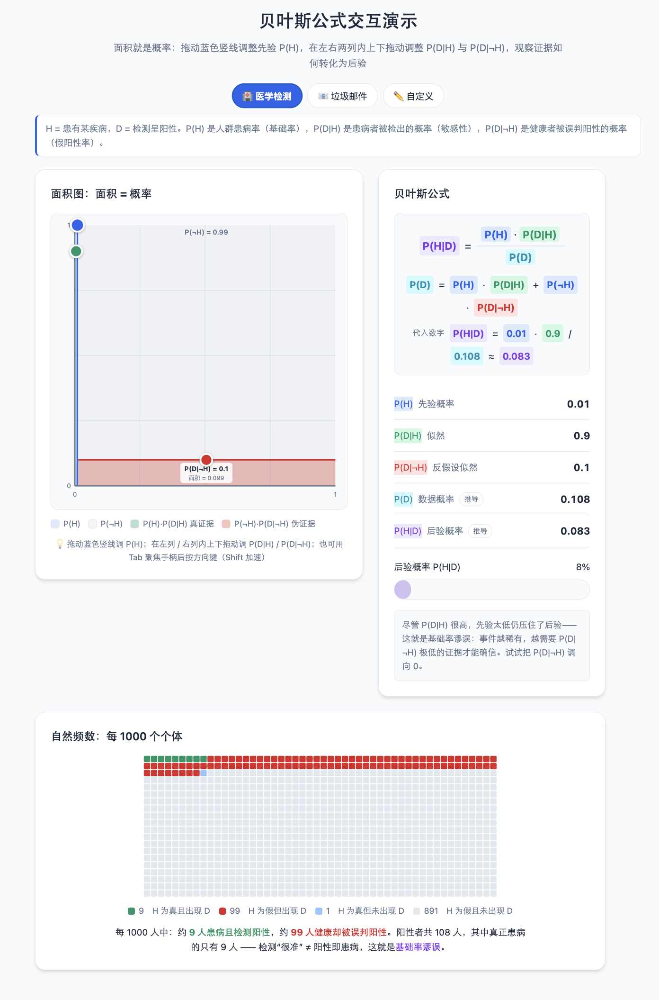

# 🎲 贝叶斯公式交互演示

<p align="center">
<a href="https://github.com/foldright/bayes-theorem-demo?tab=MIT-1-ov-file"></a>
<a href="https://github.com/foldright/bayes-theorem-demo"></a>
</p>

一个**零依赖的单文件 HTML 页面**，用「面积 = 概率」的可拖拽面积图 + 1000 人点阵，把贝叶斯公式从抽象符号变成可以上手摆弄的具体对象。适合课堂教学、自学理解，或嵌入任何课程页面。

打开后默认进入「🏥 医学检测」场景——这是理解贝叶斯最经典、最反直觉的例子。

<a href="https://foldright.io/bayes-theorem-demo" target="_blank">
</a>

## 页面导览

### 面积图（左侧卡片）：整张图就是一个单位正方形，面积就是概率

| 操作 | 效果 |
|---|---|
| 拖动**蓝色竖线**（或蓝色手柄） | 调整先验 `P(H)` —— 左列宽度 |
| 在**左列**内上下拖动（或绿色手柄） | 调整 `P(D\|H)` —— 绿区高度 |
| 在**右列**内上下拖动（或红色手柄） | 调整 `P(D\|¬H)` —— 红区高度 |
| `Tab` 聚焦手柄后按方向键 | 键盘微调（±0.01，`Shift` 加速为 ±0.1，`Home`/`End` 到端点） |

- 蓝列 = H 为真的世界，灰列 = H 为假的世界
- **绿区面积 = `P(H)·P(D|H)`**（真证据），**红区面积 = `P(¬H)·P(D|¬H)`**（伪证据）
- **后验 `P(H|D)` = 绿区 ÷（绿区+红区）** —— 这就是整张图要讲的一句话

### 公式与结果（右侧卡片）

- 符号公式 + **实时代入数字**：`0.9 · 0.01 / 0.108 ≈ 0.083`，颜色与图表一一对应
- 五个指标中，`P(D)` 与 `P(H|D)` 带「推导」徽章——它们不是独立旋钮，而是结果
- 紫色后验条 + 一句**情境化解读**（会根据参数自动指出"基础率谬误""证据无判别力"等关键点）

### 自然频数（底部通栏）：每 1000 个个体

把概率翻译成人数：绿格 = H 真且出现 D，红格 = H 假但出现 D。数一数格子：**后验 = 绿/(绿+红)**，与公式结果互相印证。

### 顶部工具

- **场景预设**：🏥 医学检测 / 📧 垃圾邮件 / ✏️ 自定义（手动拖任意参数自动切换）
- **🔗 分享**：当前参数会写入网址（`#p=0.01&l=0.9&f=0.1`），一键复制链接——备课时可以提前调好参数、把链接发给学生
- **🌙 主题**：明暗切换，选择会被记住

## 五分钟演示脚本（给讲师）

> 以医学检测场景为例，这是贝叶斯最震撼的一课。

1. **提问（1 分钟）**：某病患病率 1%。某检测：患病者 90% 被检出（敏感性），健康者 10% 被误判阳性（假阳性率）。你的检测结果是阳性——你真患病的概率是多少？让大家先猜。（多数人会说 80~90%。）
2. **揭示（1 分钟）**：页面上的答案是 **≈8.3%**。指着面积图：绿区（真阳性）只有细细一条 `0.009`，红区（假阳性）却有 `0.099` —— 假阳性是真阳性的 11 倍。
3. **点阵验证（1 分钟）**：滑到底部。每 1000 人中：约 9 人患病且阳性（绿），约 99 人健康却阳性（红）。阳性者共 108 人，真正患病的只有 9 人 → `9/108 ≈ 8.3%`。
4. **关键洞察（1 分钟）**：把 `P(D|¬H)` 从 0.1 拖向 0，观察红区消失、后验飙升。**对付罕见病，光"测得准"（高敏感性）不够，必须"误判少"（低假阳性率）**。
5. **收尾（30 秒）**：三句话总结——面积就是概率；后验 = 真证据占全部证据的比例；**永远不要忽略基础率**。

## 建议自己动手的实验

| 操作 | 观察 | 结论 |
|---|---|---|
| 医学检测预设，把 `P(D\|¬H)` 拖到 0.01、再拖到 0 | 后验 8% → 50% → ~100% | 假阳性率是稀有事件检测的命门 |
| 拖动让 `P(D\|H)` ≈ `P(D\|¬H)` | 后验 ≈ 先验 | 两边同样可能出现的证据没有判别力 |
| 把 `P(H)` 拖到 0.99 | 即使证据一般，后验也很高 | 强先验需要强反证才能推翻 |
| p=0.01, l=0.99, f=0.001 | 后验 ≈91% | 低基础率**可以**被足够强的证据推翻 |
| 把 `P(D\|H)` 和 `P(D\|¬H)` 都拖到 0 | 后验显示「—」 | `P(D)=0`：不可能出现的数据无法作为条件 |

## 为什么这样设计能帮助理解

- **面积 = 概率（eikosogram）**：贝叶斯公式本质是"部分占整体的比例"。把概率画成面积后，后验从代数符号变成肉眼可见的比例关系，且三个参数各自独立、没有隐藏约束——每一次拖动都精确对应公式里的一个量。
- **自然频数**：Gigerenzer 等人的研究表明，"1000 人中 9 真阳性、99 假阳性"远比"P(H)=0.01"易于推理。点阵视图把同一件事用频率语言重讲一遍，两种表征互相印证。
- **具体情境 + 反直觉冲突**：先猜后看（90% vs 8.3%）制造认知冲突，是最有效的学习契机。
- **颜色语义全程一致**：蓝=先验、绿=似然/真证据、红=反假设/伪证据、青=P(D)、紫=后验，图表、公式、指标、点阵说的是同一套语言。

## 常见问题

**Q：检测 90% 准确，为什么阳性后真患病只有 8%？**
两个"90%"根本不是一回事：`P(D|H)=90%` 是"患病者中检测阳性的比例"，而你想要的 `P(H|D)` 是"阳性者中真患病的比例"。健康人基数太大（990 人），10% 的假阳性率就贡献了 99 个假阳性，淹没了 9 个真阳性。

**Q：为什么后验 = 绿/(绿+红)？**
条件概率的定义：在"已经出现 D"的世界里，H 为真占多大比例。出现 D 的总面积是绿+红（= `P(D)`），其中 H 为真的部分是绿（= `P(H)·P(D|H)`）。

**Q：为什么不能直接拖动 `P(D)`？**
`P(D)` 不是自由参数——它由 `P(H)`、`P(D|H)`、`P(D|¬H)` 唯一决定（全概率公式）。本页面让你控制真正独立的三个量，`P(D)` 与后验实时推导显示。

**Q：`P(D)=0` 时为什么显示「—」？**
后验 = 分子/`P(D)`，除以零无定义：一个在此参数下根本不可能出现的数据，无法作为推理的出发点。

## 数学模型

用户直接控制三个原生参数（范围均为 `[0,1]`）：

- `P(H)` 先验 —— 蓝色分割线
- `P(D|H)` 似然 —— 左列竖拖
- `P(D|¬H)` 反假设似然 —— 右列竖拖

页面实时推导：

```
P(D)   = P(H)·P(D|H) + P(¬H)·P(D|¬H)
P(H|D) = P(H)·P(D|H) / P(D)     （P(D) > 0 时）
```
